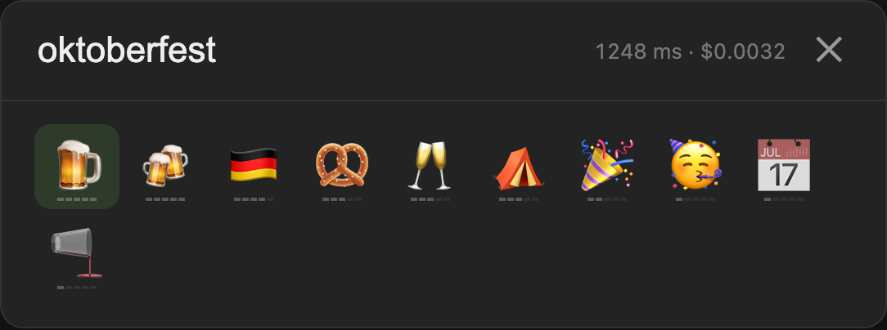

# jevmoji

An emoji picker where [TypeSafe](https://typesafe.ai)'s Jev model decides every result: one yes/no question per emoji, asked in parallel.



## usage

```sh
echo "TYPESAFE_API_KEY=..." > .env
uv run uvicorn server:app --port 8765
```

Open http://localhost:8765.
